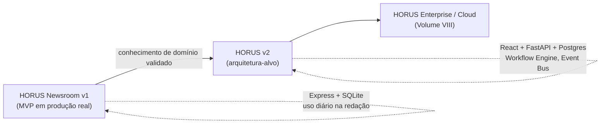

# Volume I — Visão do Produto
## Capítulo 1 — Introdução

> Status: ✅ Concluído · [Voltar ao índice-mestre](../README.md)

---

### 1.1 O problema do jornalismo moderno

Uma redação de televisão — universitária, pública ou comercial — não sofre
por falta de ferramentas. Sofre pelo excesso delas, desconectadas.

Uma pauta nasce num grupo de WhatsApp ou numa planilha de sugestões. Vira
um documento Word quando é aprovada. O produtor manda por e-mail pro
repórter. O repórter escreve a lauda num editor qualquer — às vezes o mesmo
Word, às vezes uma ferramenta própria, às vezes ainda no papel. Os GCs
(geradores de caracteres) vão pra outra planilha, que o operador de
caracteres tem que abrir separadamente durante o jornal. O espelho do
telejornal — a ordem e o tempo de cada matéria — é montado numa terceira
ferramenta, ou numa lousa, ou de cabeça pelo editor-chefe. O texto que vai
pro teleprompter é copiado manualmente da lauda pra mais um programa,
torcendo pra ninguém ter mudado uma vírgula na lauda depois da cópia.

Cada transição entre essas ferramentas é um ponto onde a informação pode se
perder, desatualizar ou divergir da fonte. Quando a pauta muda de mão — do
produtor pro repórter, do repórter pro editor, do editor pro apresentador —
não existe uma verdade única. Existem cópias. E cópias divergem.

Esse problema não é exclusivo de redações pequenas. É estrutural: nasce da
ausência de um sistema central que acompanhe o ciclo de vida editorial do
início ao fim — da sugestão de pauta até o texto que passa na tela do
teleprompter, ao vivo. Redações grandes resolvem isso comprando um NRCS
comercial. Redações universitárias, públicas e pequenas comerciais, na
prática, não têm essa opção — e o problema descrito acima é exatamente a
realidade observada, na prática, na produção da TV UFMA antes e durante a
construção do HORUS Newsroom v1, a versão hoje em produção que precede
este documento.

Cinco fatores agravam especificamente o cenário de uma emissora
universitária ou de pequeno porte:

**Restrição orçamentária real.** Um contrato de NRCS comercial (ENPS, Dalet,
Octopus) é dimensionado para emissoras com departamento de TI dedicado e
orçamento anual de licenciamento. Isso está fora da realidade de uma TV
universitária financiada por verba pública, ou de uma emissora comercial de
pequeno porte competindo com custos operacionais apertados.

**Alta rotatividade de equipe.** Numa redação universitária, a equipe se
renova a cada semestre ou ano — estudantes se formam, novos entram. Um
sistema que exige dias de treinamento para operação básica é, na prática,
um sistema que a redação nunca aprende a usar direito, porque quando
alguém finalmente domina a ferramenta, já está de saída.

**Convergência multiplataforma como regra, não exceção.** Uma pauta hoje
raramente vira só matéria de TV. Vira TV, Instagram, YouTube e site, quase
sempre com o mesmo repórter responsável por adaptar o conteúdo pras quatro
saídas. Ferramentas pensadas só pra televisão linear tratam isso como
funcionalidade extra; deveria ser parte do modelo de dados desde a
concepção.

**Timing crítico do ao vivo.** Um telejornal ao vivo não perdoa atraso. Cada
etapa — pauta aprovada, lauda escrita, item posicionado no espelho,
teleprompter sincronizado com o texto certo — precisa estar visível e
coordenada em tempo real para quem está no estúdio, na ilha de edição e na
régie, ao mesmo tempo. Planilhas e documentos avulsos não notificam
ninguém quando algo muda.

**Perda de memória institucional.** Quando um repórter se forma ou um
profissional muda de emissora, o conhecimento operacional acumulado —
como cobrir determinado tipo de evento, contatos de fontes, o histórico de
pautas já feitas sobre um assunto — vai embora com a pessoa, porque nunca
existiu um sistema que registrasse isso de forma pesquisável.

O HORUS parte da premissa de que esses cinco fatores não são
particularidades de uma emissora — são o modo como a maioria das redações
fora do topo do mercado realmente opera. Um NRCS desenhado só para quem já
pode pagar um NRCS comercial deixa de fora exatamente quem mais precisa de
um.

---

### 1.2 O que é um NRCS

**NRCS** — *Newsroom Computer System* — é o sistema central que coordena o
ciclo de vida editorial completo de uma redação: do planejamento da pauta
até a veiculação do conteúdo, e tudo o que acontece entre esses dois
pontos.

A ideia central de um NRCS é simples de enunciar e difícil de executar bem:
**toda a redação trabalha dentro do sistema, não ao redor dele.** A pauta
não é um documento que alguém eventualmente importa pro sistema — a pauta
*nasce* no sistema. O espelho do telejornal não é montado numa ferramenta
separada e depois comunicado ao teleprompter — o espelho *é* a fonte que
alimenta o teleprompter, em tempo real, sem cópia manual.

Historicamente, os NRCS surgiram nos anos 1990, quando redações de
televisão começaram a digitalizar a produção de texto e a integração com
automação de estúdio. Os nomes mais estabelecidos do mercado internacional
incluem o **ENPS**, desenvolvido pela Associated Press e adotado por
emissoras em dezenas de países; o **iNEWS**, da Avid; o **Octopus**, da
Annova Media; o **Dalet**; o **OpenMedia**, da CGI; e o **Ross Inception**,
da Ross Video. No mercado de língua portuguesa, a referência mais próxima é
o **Arion**, da SNews — um NRCS pensado para o contexto de emissoras
brasileiras e portuguesas, e a inspiração direta que motivou o início deste
projeto.

O HORUS observa essas referências, mas não pretende ser um clone de
nenhuma delas — esse ponto é desenvolvido com mais detalhe na seção 1.3.

Independentemente do fornecedor, um NRCS maduro oferece um núcleo comum de
capacidades:

1. **Planejamento editorial** — sugestão, aprovação e organização de pautas,
   com atribuição de equipe e prazo.
2. **Ingestão de fontes externas** — feeds RSS, conteúdo de agências de
   notícias (wire services), redes sociais.
3. **Criação e versionamento de matérias** — o texto editorial evolui em
   estágios (rascunho, revisão, aprovado), com histórico de mudanças.
4. **Montagem de rundown** (o espelho do telejornal) — a ordem, o tempo e o
   status de cada item que vai ao ar.
5. **Integração com teleprompter** — o texto que o apresentador lê é o
   mesmo texto do sistema, sincronizado, não uma cópia.
6. **Integração com automação de estúdio** — historicamente via protocolo
   **MOS** (*Media Object Server*), que permite ao NRCS conversar com
   sistemas de playout, geração de caracteres e switchers de vídeo.
7. **Publicação multiplataforma** — o mesmo conteúdo editorial adaptado
   para TV, web, redes sociais, sem retrabalho manual de reescrita total.

Essas sete capacidades formam o esqueleto que orienta a arquitetura descrita
no Volume II e a divisão de módulos do Volume IV deste documento.

---

### 1.3 Objetivos do HORUS

O ponto de partida deste projeto foi prático, não teórico: construir e
operar um sistema real numa redação real — o HORUS Newsroom v1 — e, a partir
dessa experiência direta, formular o que um NRCS de verdade precisa ser
para servir esse tipo de redação bem.

O HORUS é a formalização dessa experiência num sistema com arquitetura
própria. Ele não pretende ser um clone do Arion, nem replicar as telas de
nenhum NRCS comercial. Os objetivos centrais são:

- **Ter identidade própria.** O HORUS resolve os problemas descritos na
  seção 1.1 do jeito que fazem sentido pra realidade observada — não
  reproduz decisões de produto de outro sistema só porque esse sistema é
  referência de mercado.

- **Ser modular por natureza, não por promessa de marketing.** Uma redação
  universitária pequena deve conseguir rodar só os módulos que precisa.
  Uma emissora maior deve conseguir crescer pra dentro do mesmo sistema,
  sem trocar de plataforma no meio do caminho.

- **Ser auditável desde a concepção.** Todo evento editorial relevante —
  quem aprovou uma pauta, quem mudou o status de um item do espelho, quem
  editou a lauda pela última vez — fica registrado e consultável. Isso é
  tratado como requisito de arquitetura (Volume II, Sistema de Auditoria),
  não como funcionalidade adicional.

- **Ser financeiramente acessível pra quem mais precisa.** Emissoras
  universitárias e públicas não têm o orçamento de uma emissora comercial
  de grande porte. O HORUS é desenhado para ser hospedável pela própria
  instituição, sem depender de contrato de licenciamento inacessível.

- **Tratar multiplataforma como parte do núcleo, não como extensão.** TV,
  site, Instagram e YouTube são destinos de publicação de primeira classe
  desde o modelo de dados (Volume III), não uma funcionalidade adicionada
  depois.

- **Ser fácil de aprender por quem vai operá-lo na prática.** Dada a alta
  rotatividade de equipe característica de redações universitárias
  (seção 1.1), a curva de aprendizado é tratada como restrição de design
  de UX (Volume V), não como detalhe de implementação.

---

### 1.4 Público-alvo

O HORUS é desenhado, em ordem de prioridade, para os seguintes perfis de
redação:

**Primário — emissoras universitárias.** O caso de uso fundador do projeto.
Orçamento restrito, equipe majoritariamente formada por estudantes com
rotatividade semestral ou anual, forte componente pedagógico (o sistema
também ensina rotina de redação a quem está aprendendo a profissão), e
necessidade de operar com poucas pessoas em múltiplas funções ao mesmo
tempo.

**Secundário — emissoras públicas e educativas de pequeno e médio porte.**
Compartilham as mesmas restrições orçamentárias das emissoras
universitárias, mas com equipe profissional fixa — o que muda algumas
prioridades de UX (menos necessidade de onboarding constante), sem mudar
as prioridades de arquitetura.

**Terciário — redações comerciais de pequeno e médio porte.** Emissoras que
não conseguem justificar o custo de um contrato ENPS ou Dalet, mas têm as
mesmas necessidades operacionais de qualquer redação de televisão: pauta,
lauda, espelho, teleprompter, multiplataforma.

**Quaternário (uso futuro) — cursos de jornalismo.** Como ferramenta de
ensino de rotina de redação profissional, independente de estar vinculada
a uma emissora universitária operante. Esse uso não orienta decisões de
arquitetura na versão inicial, mas é considerado na extensibilidade do
sistema de permissões (Volume II) e do roadmap de longo prazo (Volume
VIII).

---

### 1.5 Visão estratégica

A trajetória do projeto é deliberadamente faseada, e o HORUS Newsroom v1
cumpre um papel específico nela — não é um protótipo descartável, é a etapa
de validação real que informa este documento.

**Fase 1 — HORUS Newsroom v1 (atual).** Um sistema funcional, em uso real na
redação da TV UFMA, construído em Express e SQLite. Cada decisão de fluxo
tomada nele — os quatro status do rundown, a lógica de Auto-Next do
teleprompter, a sincronização entre monitores de resoluções diferentes, a
cópia da Cabeça da Lauda pro teleprompter com aviso de dessincronia — foi
testada contra o uso real de uma redação, não contra suposição de mercado.
Essa fase continua rodando e evoluindo em paralelo à escrita deste
documento.

**Fase 2 — HORUS v2 (arquitetura-alvo deste documento).** A formalização
dessas decisões validadas numa arquitetura própria, pensada desde o início
para o conjunto completo de capacidades descrito neste documento — não uma
extensão incremental do código da v1, mas um sistema novo que carrega o
conhecimento de domínio adquirido na Fase 1.

**Fase 3 — HORUS Enterprise / Cloud / Mobile.** Detalhada no Volume VIII —
o crescimento do sistema para operação multi-organização, hospedagem em
nuvem e acesso móvel, uma vez que o núcleo do produto esteja maduro.

O ponto central desta visão estratégica: **não há migração técnica direta
prevista entre a Fase 1 e a Fase 2.** O que se transporta de um sistema
para o outro é conhecimento de domínio — o entendimento preciso de como uma
redação real usa cada funcionalidade — não código, nem schema de banco de
dados.

---

### 1.6 Filosofia do projeto

Seis princípios orientam toda decisão de produto e de arquitetura descrita
nos volumes seguintes:

**Editorial-first, não tech-first.** Toda decisão técnica se justifica por
uma necessidade real de redação. A escolha de arquitetura orientada a
eventos (Volume II) não existe porque é uma tendência de mercado — existe
porque uma redação precisa que uma mudança de status num item do espelho
notifique, em tempo real, o operador de teleprompter, o editor-chefe e o
painel de acompanhamento, todos ao mesmo tempo, sem que cada um precise
atualizar a página manualmente.

**Complexidade progressiva.** O sistema é simples por padrão e poderoso
quando necessário. Uma redação pequena não deve ser obrigada a configurar
um workflow editorial de dez etapas se só precisa de três. O motor de
workflow (Volume VI) é configurável, não imposto.

**Auditabilidade como cidadão de primeira classe.** Não é um relatório
gerado depois — é uma característica do modelo de dados desde a concepção
(Volume III, entidade `Audit`; Volume II, Sistema de Auditoria).

**Tecnologia enfadonha onde importa** (*boring technology*). Escolhas de
infraestrutura — banco de dados, protocolo de comunicação, formato de
mensageria — priorizam estabilidade e sustentabilidade por uma equipe
pequena, não a tecnologia mais nova disponível. Uma redação universitária
não tem uma equipe de plantão 24 horas para lidar com infraestrutura
experimental.

**Enraizado em dor real de redação, não em suposição de mercado.** Cada
funcionalidade descrita neste documento remonta a uma necessidade
observada na operação real da TV UFMA ou a uma lacuna identificada por
comparação direta com sistemas de mercado (seção 1.2). Nenhuma
funcionalidade existe apenas porque "sistemas grandes têm isso".

**Português e lusofonia em primeiro lugar, arquitetura pensada para
internacionalização.** O produto nasce para servir redações de língua
portuguesa — a interface, a documentação e as decisões de UX partem desse
público. Mas o modelo de dados e a arquitetura (Volumes II e III) não
acoplam texto de interface ao domínio de forma que impeça, no futuro,
suportar outros idiomas.

---

*Próximo capítulo: [1.2 — Conceito do HORUS](../README.md) (planejado) —
por que "Hórus", a inspiração no Olho de Hórus, missão, visão e valores.*
